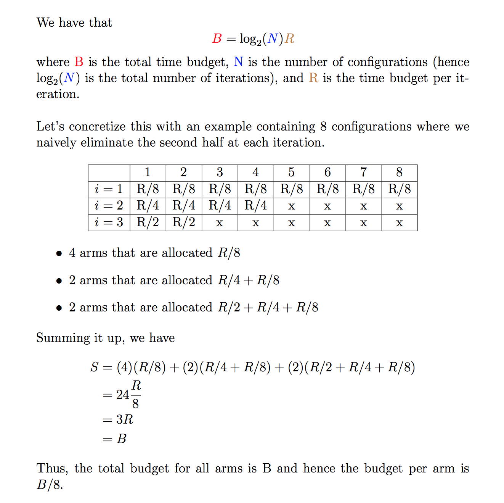

## Hyperband: A Novel Bandit-Based Approach to Hyperparameter Optimization

* exploits the iterative algorithms of machine learning and embarassing parallelism of hyperparameter optimization
* poses the problem as a hyperparameter *evaluation* problem rather than a hyperparameter *selection* problem
* allocates more resources to promising hyperparameter configurations while quickly eliminating poor ones
* adaptive computation increases efficiency, thereby examining orders of magnitude more hyperparameter configurations
* relies on an early-stopping strategy for pruning hyperparameter configurations
* overall a general-purpose technique, making minimal assumptions about the problem

## Intuition

If a hyperparameter configuration is destined to be the best after a large number of iterations, it is more likely than not to perform in the top half of configurations after a small number of iterations.

Another way of phrasing this is that even if performance after a small number of iterations is very unrepresentative of the configuration's *absolute* performance, its *relative* performance compared with many alternatives trained with the same number of iterations is roughly maintained. This is particulary intuitive for machine learning algorithms which are trained using SGD: the iterative nature of training means that if a certain set of parameters have been performing badly for a few iterations, then we might as well kill it off and try a different set of parameters.

We should note however that there are some counterexamples to this. For the learning rate, for example, smaller values will likely appear to perform worse for a small number of iterations but may outperform the pack after a large number of iterations. We'll see how the authors fight this in the next section.

## Algorithm

Hyperband extends the *Successive Halving* algorithm and calls it as a subroutine. The idea behind this algorithm is to uniformly allocate a budget to a set of hyperparameter configurations, evaluate the performance of all configurations, throw out the worst half, and repeat until one configurations remains. Thus, successive halving allocates **exponentially** more resources to more promising configurations.

Given a fixed time budget `B` and `n` hyperparameter configurations, `B/n` resources are allocated on average across the configurations.

 

## Proofs

* Successive halving sees more parameter configurations than pure random search

## Implementation

Hyperband requires the ability to:

* sample a hyperparameter configuration (`get_random_config()`)
* train a particular configuration for a set number of iterations and evaluate loss on the validation set (`run_config()`)

## Resources

- [Hyperband Demo](https://people.eecs.berkeley.edu/~kjamieson/hyperband.html)
- [Embracing the Random](http://www.argmin.net/2016/06/23/hyperband/)
- [Tuning Hyperparams Fast with Hyperband](http://fastml.com/tuning-hyperparams-fast-with-hyperband/)